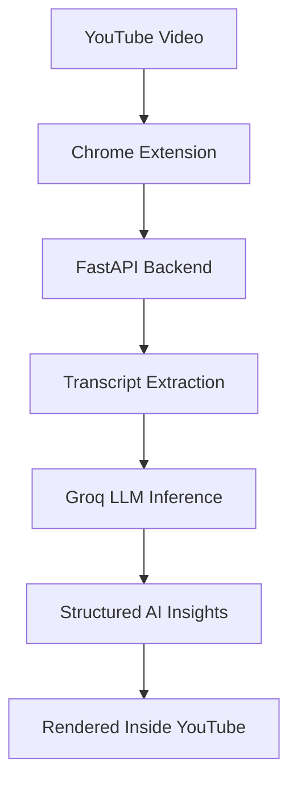

  <h1>Curiovex</h1>

  <p>
    <strong>AI-powered YouTube intelligence extraction engine built as a Chrome Extension + FastAPI backend.</strong>
  </p>

  <p>
    <a href="https://www.plasmo.com/"></a>
    <a href="https://www.typescriptlang.org/"></a>
    <a href="https://fastapi.tiangolo.com/"></a>
    <a href="https://groq.com/"></a>
    <a href="LICENSE"></a>
  </p>
</div>

---

## Overview

Curiovex analyzes YouTube videos using transcript extraction and LLM reasoning, then renders structured insights directly inside the YouTube interface.

It is designed for people who use long-form videos, podcasts, interviews, lectures, and business content as a learning source, but want the knowledge compressed into a clean, action-ready format.

## What Curiovex Does

- Extracts YouTube video transcripts.
- Summarizes long videos instantly.
- Generates structured key insights.
- Converts podcasts and interviews into readable knowledge notes.
- Supports educational, business, and founder-style analysis.
- Handles English and Hindi transcript fallback.
- Runs AI reasoning through a lightweight local backend.
- Injects a polished floating intelligence panel inside YouTube.

## Core Philosophy

> Stability first. Intelligence second.

Curiovex was rebuilt around a deliberately minimal architecture. Earlier experiments explored local embeddings, ONNX inference, browser-side transformers, RAG pipelines, vector databases, OpenRouter streaming, chunk ranking, and background inference workers.

Those systems were powerful on paper, but unstable in practice. They caused browser freezes, WASM deadlocks, timeout loops, memory pressure, stale extension state, and debugging chaos.

The current system is intentionally:

- deterministic
- lightweight
- fast
- easy to debug
- local-first
- stable enough to extend

## Architecture



## System Design

### Frontend

The extension is built with TypeScript and Plasmo.

Responsibilities:

- Detect the current YouTube watch page.
- Extract the active video ID and page metadata.
- Send the analysis request to the local backend.
- Inject the Curiovex panel into the YouTube DOM.
- Render summaries, tags, insights, action items, difficulty, learning value, and suitable audience.
- Show a graceful fallback when the backend or transcript extraction fails.

### Backend

The backend is built with FastAPI and Python.

Responsibilities:

- Receive video analysis requests.
- Fetch transcripts with language fallback.
- Trim transcript input for faster inference.
- Send a compact prompt to Groq.
- Return structured JSON to the extension.

## Features

### Working Features

- YouTube watch-page integration.
- Floating dark intelligence panel.
- Transcript-based video summarization.
- Topic tag generation.
- Key insight extraction.
- Action item extraction.
- Difficulty scoring.
- Learning value scoring.
- Suitable-audience recommendation.
- English and Hindi transcript fallback.
- Local FastAPI transport.
- CORS-safe localhost development.
- Error recovery for unavailable transcripts and failed AI responses.

### Removed Systems

| Removed system | Why it was removed |
| --- | --- |
| ONNX Runtime | Browser freezes and heavy runtime cost |
| Xenova Transformers | Large memory overhead |
| Local embeddings | WASM deadlocks and slow startup |
| OpenRouter streaming | Transport instability |
| Browser-side LLMs | Unstable extension lifecycle |
| RAG pipelines | Over-engineered for the current product |
| Vector database | Unnecessary complexity |
| Chunk ranking | Premature optimization |
| Background AI workers | Hard to debug reliably |

## Tech Stack

| Layer | Technology |
| --- | --- |
| Frontend | TypeScript |
| Extension framework | Plasmo |
| Browser platform | Chrome Extension APIs, Manifest V3 |
| Backend | FastAPI, Python |
| Transcript extraction | `youtube-transcript-api` |
| AI inference | Groq SDK |
| Transport | Localhost HTTP + Fetch API |

## Project Structure

```text
curiovex/
├── assets/
│   ├── curiovex-mark.svg
│   ├── icon.png
│   └── screenshots/
│       ├── curiovex-panel.png
│       └── curiovex-panel-detail.png
├── backend/
│   ├── main.py
│   └── requirements.txt
├── contents/
│   └── youtube.ts
├── package.json
├── LICENSE
└── README.md
```

## Backend Setup

Create and activate a Python environment:

```bash
cd backend
python3 -m venv venv
source venv/bin/activate
```

On Windows:

```bash
venv\Scripts\activate
```

Install dependencies:

```bash
pip install -r requirements.txt
```

Create `backend/.env`:

```env
GROQ_API_KEY=your_groq_api_key
```

Start the backend:

```bash
uvicorn main:app --reload --host 127.0.0.1 --port 8000
```

The extension expects the backend at:

```text
http://127.0.0.1:8000/analyze
```

## Extension Setup

Install dependencies from the project root:

```bash
npm install
```

Run the development build:

```bash
npm run dev
```

Create a production build:

```bash
npm run build
```

## Load Into Chrome

1. Open `chrome://extensions/`.
2. Enable Developer mode.
3. Click Load unpacked.
4. Select `build/chrome-mv3-prod`.
5. Open a YouTube video.
6. The Curiovex panel appears inside the YouTube interface.

## AI Prompting Strategy

Curiovex uses minimal prompting by design.

No prompt trees. No multi-agent orchestration. No browser-side model loading. No streaming transport layer.

The backend sends the transcript with a concise instruction and asks the model for structured output. This keeps the system easier to reason about and reduces failure points.

## Performance Choices

### Transcript Truncation

Large transcripts can slow inference, exceed token budgets, and create timeout failures. Curiovex trims transcript text before sending it to the model:

```python
text = text[:1500]
```

### Fast Groq Inference

The backend uses a fast Groq-hosted 8B-class model for low-latency local development. The exact model name is configured in `backend/main.py`, making it easy to switch as Groq model availability changes.

## Engineering Lessons

The biggest lesson from building Curiovex:

> Build the smallest working system first.

The project became stable only after removing complexity, eliminating local AI inference, simplifying transport, and reducing the inference load.

## Roadmap

- Founder mode for business and startup takeaways.
- Learning mode for educational highlights.
- Execution mode for action-focused summaries.
- Timestamp anchors for jumping to important moments.
- Transcript caching to avoid repeated fetches.
- Configurable backend URL from an options page.
- Lightweight semantic ranking after the stable base is complete.

## Contributing

Pull requests are welcome. For major changes, please open an issue first and discuss the architecture.

The project prioritizes simplicity, stability, and clear debugging over adding complex AI layers too early.

## License

This project is licensed under the MIT License. See [LICENSE](LICENSE).

## Creator

Built by **Vindhya Verma**.

<div align="center">
  <strong>Curiovex is an experiment in lightweight AI-assisted knowledge extraction for the modern web.</strong>
</div>
